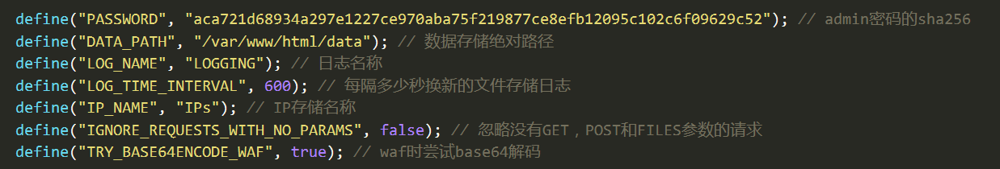
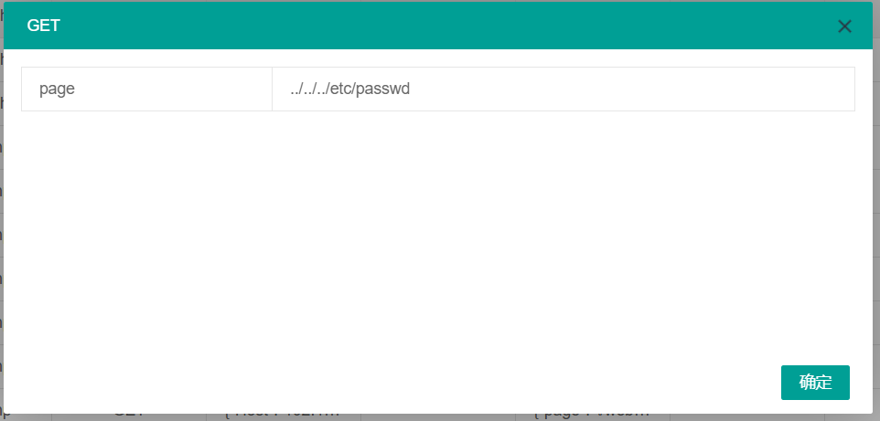
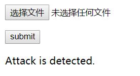
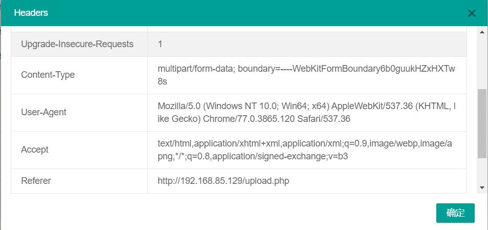
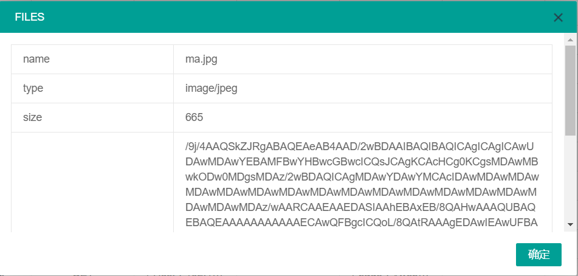
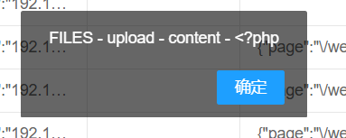

针对 AWD 中 php 网页设计的 waf，主要有三个功能：
1. 记录所有 status_code==200 的请求，记录的字段包括：时间、IP、请求文件、请求方法、headers、cookies、GET、POST、FILES。
2. 拦截预先设置的攻击流量，并记录是否被拦截，以及拦截原因。
3. 可视化浏览所有流量记录，并可根据  IP 和时间进行搜索。

# 目录结构

──── waffffff
    │   admin.php 
    │   api.php
    │   check.php
    │   config.php 
    │   functions.php
    │   waf.php

# 使用

将 waf 文件夹直接复制到 web 网站根目录下即可。

## 配置

基本配置在 config.php 下：



* PASSWORD：流量查看界面的密码的 sha256 值。
* DATA_PATH：日志、IP 存储的文件夹的绝对路径，php 进程用户（如 www-data）必须对该文件夹具有可写权限。否则无法记录攻击流量。设置好后可以运行 check.php 检查权限。
* LOG_NAME：所有流量记录的日志名称前缀。
* LOG_TIME_INTERVAL：每隔多少秒换新的文件存储日志，推荐为每轮的时间。
* IP_NAME：攻击源 IP 记录的存储名称。
* IGNORE_REQUESTS_WITH_NO_PARAMS：是否忽略没有 GET，POST 和 FILES 参数的请求。
* TRY_BASE64ENCODE_WAF：拦截时先尝试 base64 解码，若解码成功，则根据解码后数据拦截。

waf 规则配置在 functions.php 中的 waf_working 函数中，注意转义。

## 上下waf

在 web 网站根目录下运行命令。一定要使用 waf 所在的绝对路径并注意转义。
```bash
上waf：
$ find . -path ./waffffff -prune -o -type f -name "*.php" -print | xargs sed -i "s/<?php/<?php include_once(\"\/var\/www\/html\/waffffff\/waf.php\");/g"

下waf：
$ find . -path ./waffffff -prune -o -type f -name "*.php" -print | xargs sed -i "s/<?php include_once(\"\/var\/www\/html\/waffffff\/waf.php\");/<?php/g"
```
## 流量查看

流量查看界面采用 layui 前端组件编写而成。

访问 web 目录下的 waffffff/admin.php?password+密码 。


headers、cookies、GET、POST、FILES 可点击查看更详细美观的表格形式数据。被拦截原因也可点击弹窗查看数据。



# 测试

上传图片马被拦截：



查看流量具体信息：





被拦截细则：

